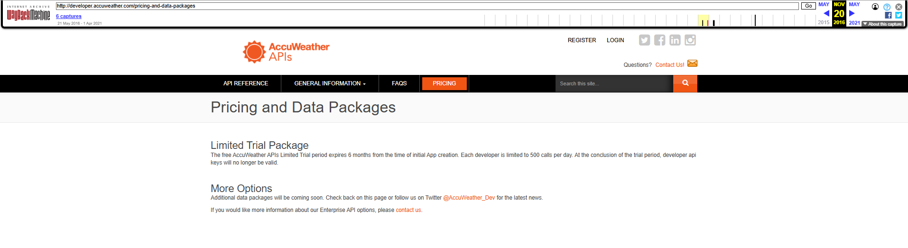

## Investigación sobre pricings antiguos de Accuweather API.

Parece que la API de Accuweather actual, en el formato con su pricing, no existía hasta el año pasado. La versión más antigua del pricing de accuweather la podemos encontrar en Septiembre de 2025.

Lo que sí hay disponible para años anteriores son versiones tempranas de la api en el dominio: https://developer.accuweather.com, aquí encontramos versiones con muy poca información sobre lo que nos interesa estudiar.

Adjunto una captura de la versión más antigua de la "API" de accuweather.

En esta web apenas encontramos información relevante, y la navegación entre páginas en la waybackmachine es muy mala, y muchas capturas de dominio están corruptas y pueden resultar ilegibles.

En este supuesto pricing de accuweather de 2016, apenas tenemos información. Lo cual crear un princing a partir de esto no es aplicable.