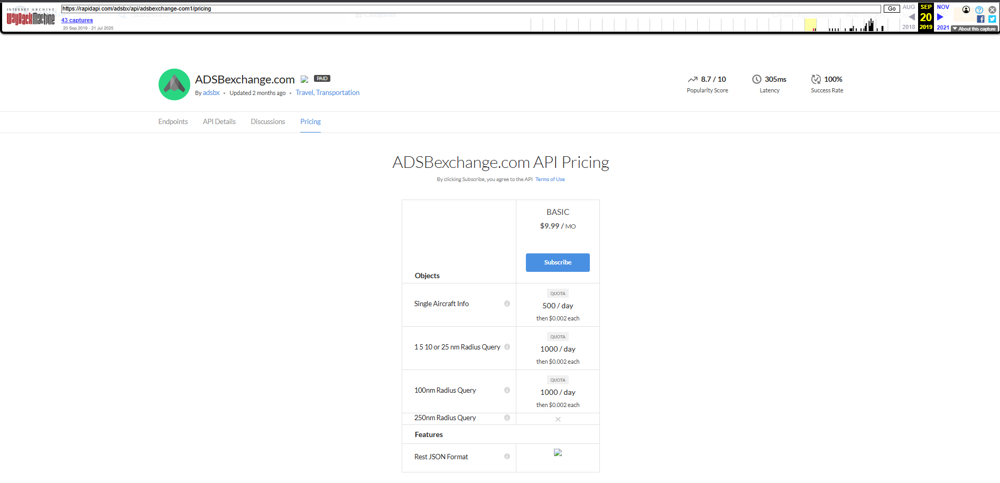

## Notas

Para la api de adsb-exchange, existe una versión temprana del año 2019, versiones previas a 2019 del pricing de RapidAPI, no existen.

Con esto a diferencia de otras apis, como la de accuweather, sí podemos modelar un pricing con esta información.