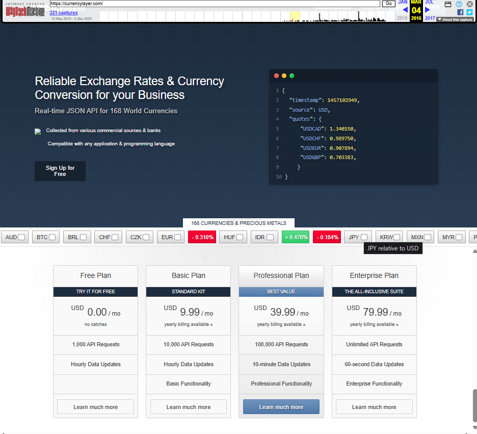

## Notas

Currencylayer está documentado en la waybackmachine desde 2015, desgraciadamente en la wayback machine no es accesible dicha entrada.

Sin embargo la entrada de 2016 es accesible, y esta presenta una estructura de pricing válida para nuestro estudio.



Este pricing si aplica.

## Notas sobre las datasheets

A la hora de determinar las datasheets, es un proceso complicado corroborar si existen límites aplicables para nuestro estudio. La wayback machine no permite una navegación real entre páginas, por lo que buscar y corroborar rate limits no aplica en estos casos.

De momento dejaremos las datasheets con valores TBD.

Ejemplo:
```yml
associatedSaaS: currencylayer (2016)
planReference: ENTERPRISE
type: Partial SaaS
capacity:
  - value: .inf
    type: QUOTA
    unit: requests
    windowType: MONTHLY
    description: "Unlimited monthly requests."
maxPower:
  value: TBD
  type: RATE_LIMIT
coolingPeriod: "None"
segmentation:
  - Data Gating: Real-time 60-second update frequency.
  - Tier Gating: "Enterprise Functionality" level (All-Inclusive).
```
